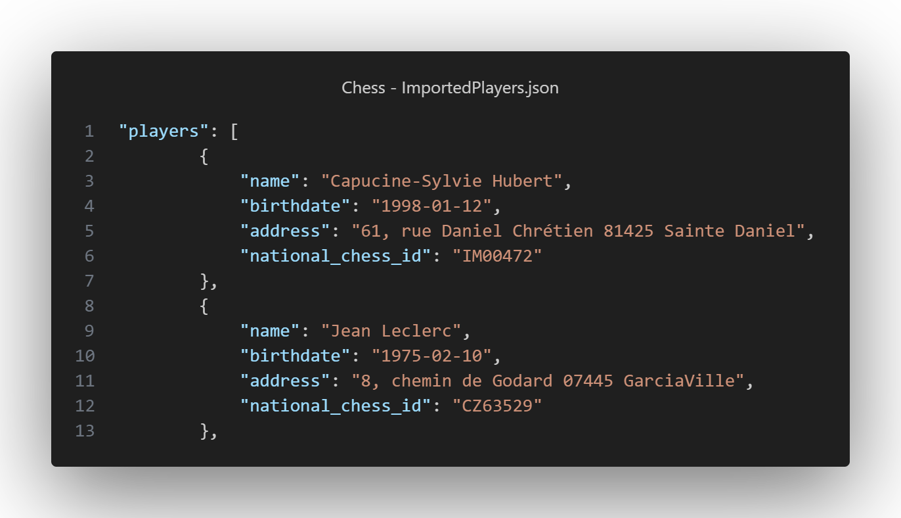

---

# 📘 README — Gestionnaire de Tournois d’Échecs (CLI)

[](https://www.python.org/)
[](https://flake8.pycqa.org/en/latest/)
[](https://www.sphinx-doc.org/)

## 🚀 Prérequis

* **Python 3.9+** installé
* **pip** et **venv** disponibles
* **Make** installé (facultatif mais recommandé)
* Un terminal (PowerShell, Bash, etc.)

---

## 📦 Installation

1. Clonez ce dépôt et placez-vous dedans :

```bash
git clone https://github.com/MithrandirEa/P4_Chess.git
cd P4_Chess
```

2. Créez et activez un environnement virtuel, puis installez les dépendances :

### 🔹 Méthode traditionnelle

```bash
python -m venv venv
venv\Scripts\activate     # Windows
source venv/bin/activate  # Linux/macOS
pip install -r requirements.txt
```

### 🔹 Méthode Makefile

```bash
make sync
```

👉 Cette commande crée automatiquement le venv s’il n’existe pas, installe `pip`, `wheel` et toutes les dépendances listées dans `requirements.txt`.

---

## ▶️ Lancer l’application

### 🔹 Méthode traditionnelle

```bash
python main.py
```

### 🔹 Méthode Makefile

```bash
make run
```
---

## 📁 Importer des joueurs

Il est possible d'importer plusieurs joueurs au moyen d'un fichier JSON devant s'appeler **ImportedPlayers.json**. Le fichier doit respecter la structure suivante :


---


---

## 📊 Rapports et affichages

### Menu des rapports

* **Joueurs FFE** (liste alphabétique depuis `Data/LicensedPlayers.json`)
* **Tous les tournois** (affiche `Data/Tournaments.json`)
* **Joueurs d’un tournoi** (affiche et trie alphabétiquement les joueurs)
* **Rounds et matchs d’un tournoi** (affiche rounds + matchs via `tabulate`)

---

## ✅ Vérification de code (Lint)

Nous utilisons **flake8** et **flake8-html** pour le style de code.

### Générer un rapport lint HTML

#### 🔹 Méthode traditionnelle

```bash
python -m flake8 --max-line-length=119 --format=html --htmldir=flake8_report
```

#### 🔹 Méthode Makefile

```bash
make lint-html
```

---

### Ouvrir le rapport dans le navigateur

#### 🔹 Méthode traditionnelle

```bash
start flake8_report/index.html    # Windows
xdg-open flake8_report/index.html # Linux
open flake8_report/index.html     # macOS
```

#### 🔹 Méthode Makefile

```bash
make lint-play
```

---

## 🔧 Autres commandes utiles (Makefile)

* **Formater le code avec Black**

  ```bash
  make format
  ```

* **Nettoyer le projet (supprimer venv, caches, rapports)**

  ```bash
  make clean
  ```

---

## 📂 Structure du projet

```
project/
│── controllers/
│   ├── tournaments_control.py
│   ├── rounds_control.py
│   └── saving_control.py
│
│── models/
│   ├── player.py
│   ├── match.py
│   ├── chessRound.py
│   └── tournament.py
│
│── views/
│   ├── menu.py
│   ├── view_models.py
│   ├── display_round.py
│   └── display_tournament.py
│ 
│── resources/
│   └── image.png
│
│── Data/
│   ├── FakePlayers.json
│   ├── LicensedPlayers.json
│   └── Tournaments.json
│
│── flake8_report/        # Rapport lint généré
│── venv/                 # Environnement virtuel (non versionné)
│── main.py
│── constant.py
│── type_validation.py
│── makefile
│── requirements.txt
└── .gitignore
```

---

